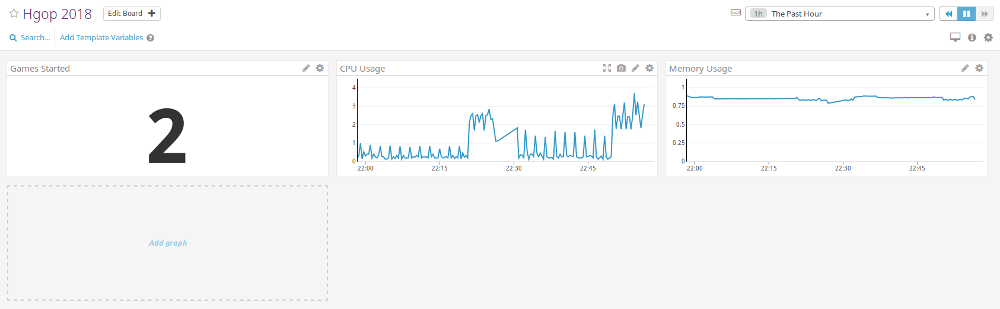

# Monitoring

## DataDog

Start by creating a [DataDog](https://www.datadoghq.com/) account.

Then add the DataDog agent as a service to your docker-compose file:
```yaml
# Based on https://github.com/DataDog/docker-compose-example
  my_datadog_container:
    image: datadog/agent:latest
    environment:
      - DD_API_KEY=********************************
      - DD_DOGSTATSD_NON_LOCAL_TRAFFIC=true
    volumes:
      - /var/run/docker.sock:/var/run/docker.sock
      - /proc/:/host/proc/:ro
      - /sys/fs/cgroup:/host/sys/fs/cgroup:ro
```

Now run docker-compose and you should see a datadog container running in parallel
with your API and postgres containers.

Check the DataDog web client, there should be an event announcing that a new DataDog
Agent has started.

The DataDog Agent alone monitors a lot of metrics such as CPU and memory usage, try
creating a new Monitor in the DataDog web client that monitors that the CPU usage
does not go above 80%.\
(You can delete once you are done)

You can also define our own metrics for DataDog to display, but you will need to:\
Integrate the `hot-shots` npm package into your project. You can see the
documentation here [hot-shots](https://www.npmjs.com/package/hot-shots), you will
need to use the DataDog's docker-compose service name for the host initialization 
parameter.

Try using `increment` for a new stat `games.started`, that should count the number of
games started, then verify that the new metric is in the DataDog web client.

Now add another environment variable to your project called `ENVIRONMENT`, it's value
should be the environment the API is running in e.g. `apitest`,  `capacitytest` or
`production`.\
You will also have to set the DataDog container's `DD_TAGS` environment variable
to the same value.

Use the new environment variable to tag each metric you send to DataDog.

Now create a dashboard in the DataDog web client which should:
- Show CPU usage (in production).
- Show memory usage (in production).
- Show number of games started (in production).
- Two other meaningful metrics.



If you do anything extra, remember to write it in the README file.
